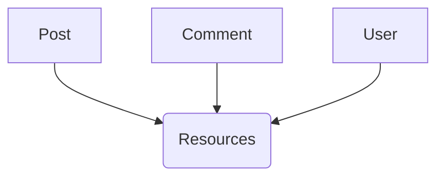
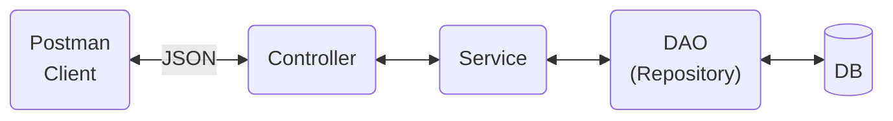

# Spring boot - Blog app

Real time REST API's for Blog App using Spring Boot, Spring Security, JWT, Hibernate, MySQL database

## Technology Stack

**Java Platform:** Java 8+

**Frameworks:** Spring Boot, Spring Security (JWT), Spring Data JPA (Hibernate)

**Build Tool:** Maven

**IDE:** Intellij IDEA

**Server:** Tomcat embedded server

**Database:** MySQL

**REST Client:** Postman

**REST API Documentation:** Swagger

**Production:** AWS
## Documentation

[Swagger Documentation](http://springbootblogapp-env.eba-k34dcz2t.eu-west-2.elasticbeanstalk.com/swagger-ui/index.html#/)

## Resources

## Application Architecture

## Author

- [@Andrew-Develops](https://github.com/Andrew-Develops)

## 🔗 Links

