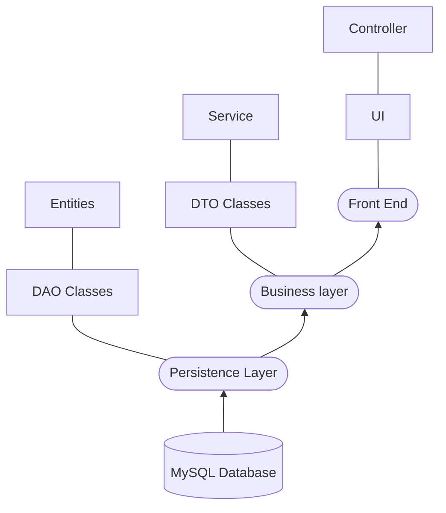

## Table of Contents
1. [General Info](#general-info)
2. [Technologies](#technologies)
### General Info

**JavaTravelAgencySpring**: modeling a travel agency that allows searching for trips according to given criteria and allow for their "purchase".

**JavaSpringRegistration**: creating a registration form where user can register, login and logout.

## Technologies

A list of technologies used within the project: JavaTravelAgencySpring
* [Hibernate](https://github.com/Andrew-Develops/JavaSmallProjects/network/dependencies)
* [Spring Boot](https://github.com/Andrew-Develops/JavaSmallProjects/network/dependencies)

A list of technologies used within the project: JavaSpringRegistration
* [Hibernate](https://github.com/Andrew-Develops/JavaSmallProjects/network/dependencies)
* [Spring Boot](https://github.com/Andrew-Develops/JavaSmallProjects/network/dependencies)
* [Thymeleaf](https://github.com/Andrew-Develops/JavaSmallProjects/network/dependencies)

## UML diagram

I use this diagram to represent the flow of data in my application

